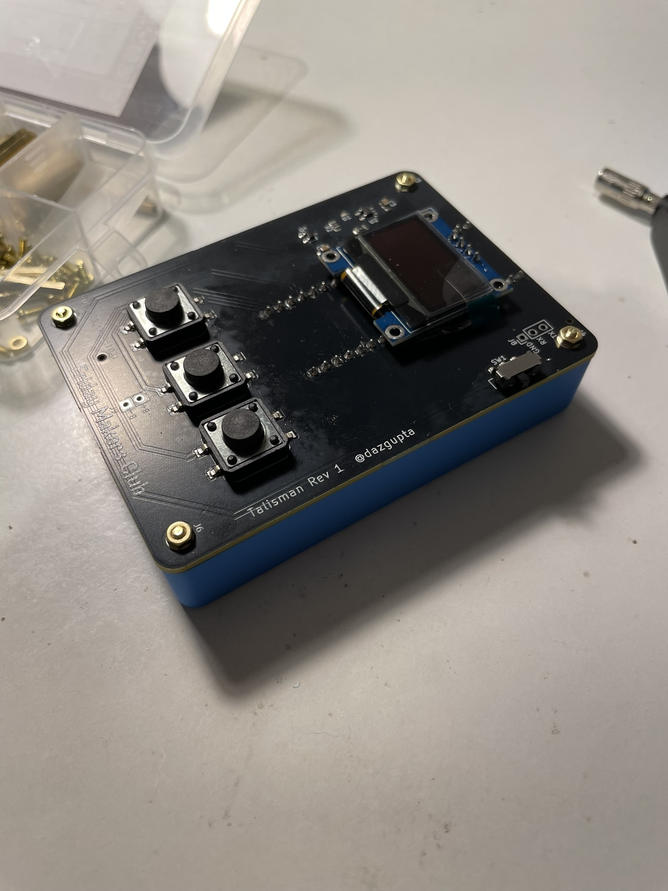

# Talisman

In at attempt to teach myself how to design PCBs, I made this trinket thingie to share with my friends. The board runs RP2040, and I am going to make some games for it.

## Current games

 - [Bike w Friends](https://github.com/arijitdasgupta/bike_w_friends/)
 - [Flappy Mycologist](https://github.com/arijitdasgupta/flappy_mycologist)

## Features

 - I2C SSD1306 based display
 - Raspberry Pi Pico brain
 - 3 x buttons
 - Shared power between battery & USB
 - Battery charging
 - 3D printable case

## Notes

The manufacturing process with PCB makers such as JLCPCB is a little convoluted, even though I added BOM, drills and rotation files those may not be usable for you. But the general schematic designs and part ids should be helpful if you decide to make one yourself. If you have any questions, do drop a note. I have purposefully omitted writing a build guide for this very reason, but I am happy to write on up if anyone needs it.

## What's Friday Makers Club?

TODO
